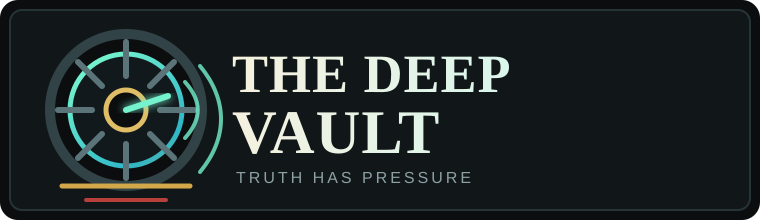
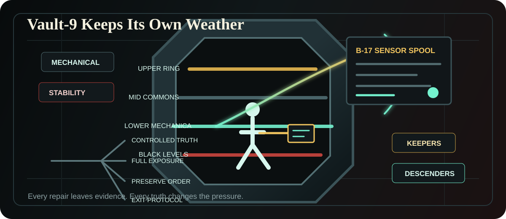

<p align="center">
  
</p>

<p align="center">
  
</p>

# The Deep Vault

The Deep Vault is a browser-based, menu-driven text RPG about investigation, trust, and public truth inside Vault-9, a sealed underground habitat built on curated survival doctrine.

You play as Tomas Vale, a low-ranking maintenance runner whose routine work exposes impossible telemetry, hidden records, and contradictions in the story the vault tells about itself. Choices affect evidence, faction trust, pressure, route direction, and ending evaluation.

## Current Build

The current implementation is a complete-game MVP at lean narrative depth. It includes:

- A React and TypeScript game shell.
- Menu-based scene progression.
- Engine-driven choice effects and route evaluation.
- Player-facing status, evidence, quest, faction, character, location, and item records.
- Local browser save and load.
- Authored MVP content covering 22 main scenes, 8 side quests, 10 major NPCs, 20 locations, 12 key items, 4 trust systems, and 4 endings.
- Route fixtures for controlled truth, full exposure, preserve order, and exit protocol endings.
- Unit, content, build, lint, and Playwright smoke-test coverage.

The playable content now runs from Tomas's maintenance fault through route commitment and an ending panel. The prose and side content are intentionally MVP-depth, with expansion and polish tracked through the spec artifacts.

## Gameplay

- Explore authored story scenes through menu choices.
- Track pressure, supplies, clearance, evidence, and route state.
- Build or damage trust with major factions such as Mechanical, Stability, Keepers, and Descenders.
- Collect records that explain discoveries, people, locations, and unresolved leads.
- Save and resume a browser playthrough from local storage.

## Visual Identity

The logo uses a sealed vault ring, maintenance signal lines, and warning bands to anchor the game around pressure, hidden infrastructure, and forbidden evidence. The wider README graphic presents Vault-9 as a layered habitat where faction pressure, sensor evidence, and route choices all converge.

## Tech Stack

- Node.js 24 LTS
- pnpm 10
- Vite
- React 19
- TypeScript
- TailwindCSS
- Vitest
- Playwright
- Docker and Dev Containers

## Project Structure

- `src/` contains the game application, engine, content, components, and unit tests.
- `tests/` contains end-to-end and content validation tests.
- `spec/` contains product requirements, feature scope, stories, design notes, architecture records, implementation plans, validation records, and release-readiness artifacts.
- `index.html`, `vite.config.ts`, `tailwind.config.ts`, and related config files define the browser runtime and build pipeline.
- `docker-compose.yml` defines the container workspace used by the planned development environment.

## Local Development

Install dependencies:

```sh
pnpm install --frozen-lockfile
```

Start the development server:

```sh
pnpm dev
```

Open the app at:

```text
http://localhost:5173
```

## Container Workflow

Build the Docker workspace and install dependencies:

```sh
make setup
```

Start the game in a container:

```sh
make run
```

Open the app at:

```text
http://localhost:5173
```

Restart the containerized game server:

```sh
make restart
```

Follow container logs:

```sh
make logs
```

Print recent workspace logs without following:

```sh
make logs-once
```

Stop and clean up containers:

```sh
make cleanup
```

Remove containers plus Docker volumes used for pnpm and Playwright caches:

```sh
make clean-volumes
```

List all Makefile targets:

```sh
make help
```

## Validation

Run the default unit tests:

```sh
pnpm test
```

Run content-focused checks:

```sh
pnpm test:content
```

Run linting:

```sh
pnpm lint
```

Build the static site:

```sh
pnpm build
```

Run Playwright end-to-end tests:

```sh
pnpm test:e2e
```

Run the full validation suite:

```sh
pnpm validate
```

GitHub Actions runs the same validation chain for pull requests and pushes to `main`.

If Playwright browsers are not installed yet, run:

```sh
pnpm test:e2e:setup
```

## Product Artifacts

The game scope and implementation rationale are documented in:

- `spec/requirements/the-deep-vault-text-rpg.md`
- `spec/features/the-deep-vault-complete-game-mvp.md`
- `spec/design/the-deep-vault-mvp-game-architecture.md`
- `spec/plans/the-deep-vault-complete-game-mvp-implementation.md`

These artifacts remain the source of truth for future expansion, polish, validation gates, and deployment work beyond the complete-game MVP.
