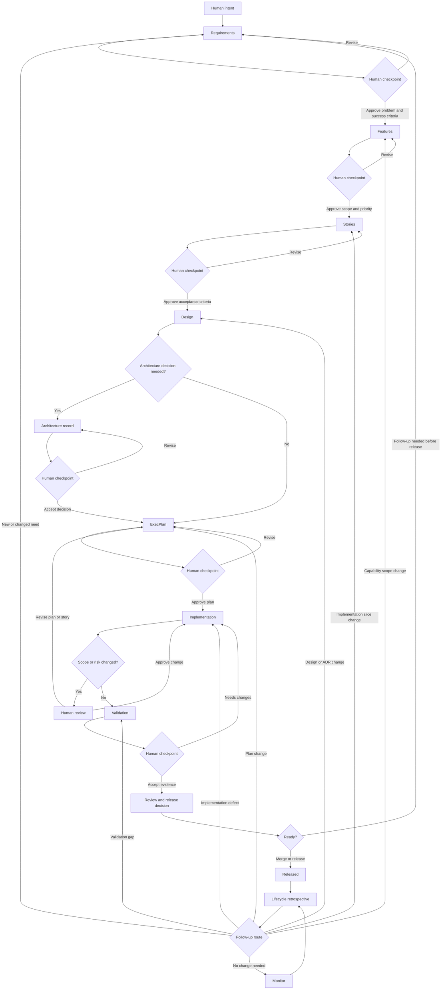

# Codex Flow Forge

Flow Forge is an AI-native product development life cycle (PDLC) workflow template that uses Codex as the runtime engine for refinement, planning, implementation, review, validation, release readiness, and lifecycle learning.

The repository is currently a reusable workflow system. Product implementation code should stay minimal until the PDLC structure, agent guidance, and specification artifacts are established.

## Repository Map

- `AGENTS.md` contains repository-wide guidance for Codex and other coding agents.
- `.codex/` contains Codex runtime configuration, agent definitions, rules, and skills. Do not add generated output here.
- `spec/` contains PDLC artifacts that describe what to build, why it matters, how work is planned, how outcomes are validated, and what is learned after release.
- `spec/release-readiness/` contains advisory release, merge, and deployment readiness records after validation review and before lifecycle learning.
- `src/` will contain product implementation code once this template is instantiated.
- `tests/` will contain executable product tests once implementation tooling exists.

## PDLC Flow

AI-native PDLC is a collaborative loop between humans and Codex. Humans own intent, judgment, prioritization, and approval. Codex owns structured drafting, analysis, implementation assistance, validation support, and keeping artifacts connected.

The flow moves from uncertain intent to validated delivery:

1. Discover intent in `spec/requirements/`.
   Humans describe the business need, user problem, constraints, risks, and success criteria. Codex helps organize the input, identify gaps, ask clarifying questions, and draft requirement artifacts.

   Human checkpoint: approve the problem statement, goals, non-goals, constraints, and acceptance criteria before feature shaping begins.

2. Shape features in `spec/features/`.
   Codex converts approved requirements into scoped features with expected outcomes, user value, behavior, and boundaries. Humans review whether the proposed scope matches the product strategy and current priorities.

   Human checkpoint: approve feature scope, reject overreach, and decide whether the feature is ready for story breakdown.

3. Prepare stories in `spec/stories/`.
   Codex breaks approved features into implementation-ready stories. Each story should be small enough to build and validate, with clear acceptance criteria and links back to requirements and features.

   Human checkpoint: approve story priority, sequencing, and acceptance criteria before implementation planning.

4. Design the solution in `spec/design/`.
   Codex drafts UX flows, system behavior, data flows, interface notes, and technical design options. Humans provide product judgment, domain expertise, UX feedback, and architectural constraints.

   Human checkpoint: approve the design direction and decide whether any architecture decision record is needed.

5. Record durable decisions in `spec/architecture-records/`.
   When a decision affects future maintainability, system boundaries, technology choices, data ownership, or operating model, Codex drafts an ADR. Humans approve the decision and its consequences.

   Human checkpoint: accept, reject, or revise the ADR before implementation work depends on it.

6. Plan execution in `spec/plans/`.
   For complex features or significant refactors, Codex creates an ExecPlan using `spec/plans/PLANS.md`. The plan must be self-contained, novice-readable, milestone-based, and tied to observable outcomes.

   Human checkpoint: approve the ExecPlan before Codex begins substantial code changes.

7. Implement in `src/`.
   Codex executes the approved story or ExecPlan, updates implementation files, keeps the plan current, and records surprises or design changes as they happen. Humans stay in the loop for product tradeoffs, ambiguous behavior, and scope changes.

   Human checkpoint: approve any meaningful scope change, irreversible migration, destructive operation, or user-visible behavior change that differs from the accepted plan.

8. Validate in `spec/validation/` and `tests/`.
   Codex runs available checks, creates or updates executable tests when product code exists, and records validation evidence. Before product tests exist, validation lives in `spec/validation/` as acceptance evidence, review notes, and manual checks.

   Human checkpoint: review evidence and decide whether the story or feature is accepted, needs changes, or should be deferred.

9. Prepare release readiness.
   Codex records release-readiness evidence in `spec/release-readiness/` by summarizing approval state, validation and CI/CD evidence, security and quality review notes, unresolved risks, rollback or recovery notes, and recommended next action. Humans decide whether to merge, release, deploy, defer, or return to an earlier PDLC stage.

   Human checkpoint: approve release or merge readiness and capture follow-up requirements, stories, ADRs, or validation gaps.

10. Review and learn in `spec/lifecycle/`.
    After release, merge, deployment, incident, or sustained usage, Codex helps capture feedback, metrics, incidents, missed assumptions, and operational learnings. Humans decide which learnings become new requirements, ADR updates, validation gates, or process changes.

    Human checkpoint: approve follow-up priorities before starting a new PDLC loop.

## Human-in-the-Loop Principles

- Humans are accountable for intent, priority, ethics, business fit, and final approval.
- Codex should make work explicit by writing artifacts, linking decisions, and showing evidence.
- Codex may proceed autonomously within an approved story or ExecPlan, but should pause for approval when scope, risk, user impact, or irreversible action changes materially.
- Codex and its subagents must not approve their own work. They may recommend readiness, but only a human can approve, accept, reject, or mark a checkpoint complete.
- Every major output should be reviewable as a file in this repository, not hidden in chat history.
- Completed work should leave behind enough context for another human or agent to continue without relying on memory.

## Codex Subagents

Project-scoped custom subagents live in `.codex/agents/` as TOML files. They are optional review roles that the main Codex agent can spawn when the user explicitly asks for subagent review or parallel agent work.

Current subagents:

- `product_coherence_reviewer` reviews whether requirements, features, and stories preserve product intent, user value, and clear scope.
- `architecture_decision_reviewer` reviews solution designs for architecture risks, durable decisions, missing ADRs, and readiness for execution planning.
- `validation_gate_reviewer` reviews acceptance criteria and validation strategy, including checks that can later become CI/CD or continuous lifecycle gates.
- `execution_plan_reviewer` reviews ExecPlans for self-containment, milestone quality, concrete steps, validation, recovery, and implementation readiness.
- `implementation_reviewer` reviews implementation changes against the approved ExecPlan, scope, acceptance criteria, validation evidence, and no-self-approval policy.
- `security_reviewer` reviews implementation changes for security, privacy, permissions, dependency risk, and abuse cases.
- `quality_gate_reviewer` reviews implementation changes for code quality, maintainability, test quality, lint/type/build gates, and Playwright evidence for UI changes.
- `release_readiness_reviewer` reviews final merge, release, or deployment readiness, including approval state, validation evidence, unresolved risks, and rollback.
- `lifecycle_learning_reviewer` reviews post-release learning, incidents, feedback, metrics, missed assumptions, and follow-up routing.

Use subagents after artifacts exist, not during early naming or tiny edits. Good checkpoints are after requirements refinement, feature shaping, story breakdown, solution design, execution planning, and implementation.

Subagent review is advisory. A subagent readiness judgment such as `Ready` does not replace human approval and must not be used to advance a PDLC checkpoint by itself.

## Artifact Lifecycle

Most work should follow this path:

```text
requirement -> feature -> story -> design -> plan -> implementation -> validation -> release readiness -> lifecycle retrospective -> follow-up routing
```



Small changes may skip some artifacts when the risk is low. Significant work should preserve the full chain so that decisions remain explainable and validation remains tied to the original intent.

## Implementation Guardrails

Implementation work should happen only after an ExecPlan is approved or a human explicitly asks Codex to implement. During implementation, Codex should:

- Create or switch to a feature branch before edits unless the human explicitly says to stay on the current branch.
- Use TDD and BDD approaches where practical by defining expected behavior first, adding tests first when tooling exists, and then making the smallest implementation change that satisfies them.
- Apply SOLID and KISS principles so responsibilities stay focused, dependencies stay explicit, interfaces stay narrow, and the implementation remains as simple as the behavior allows.
- Use established design patterns when they clarify boundaries, lifecycle, orchestration, or extension points; avoid patterns that add ceremony without reducing real complexity.
- Validate that the implementation is usable through available lint, typecheck, build, unit, integration, manual, and end-to-end checks.
- Use Playwright for browser UI validation when a UI exists, including screenshots as reference evidence when useful.
- Review changes against the approved design, security expectations, quality gates, validation gates, and the no-self-approval policy before asking for human acceptance.

Codex and subagents can report readiness, but humans approve implementation completion.

## Validation Review

After implementation, Codex should use the `validation-review` skill to create or update validation evidence under `spec/validation/`. Validation review maps evidence back to requirements, features, stories, designs, ADRs, and ExecPlans.

Validation review should distinguish:

- Checks that passed.
- Checks that failed.
- Checks that were skipped.
- Checks that could not run because tooling or infrastructure does not exist yet.
- Checks that should become future CI/CD or continuous lifecycle gates.

Validation review is not release approval. Codex and subagents may recommend readiness, but only a human can accept validation and move work toward release readiness.

## Release Readiness

After validation review, Codex should use the `release-readiness` skill to prepare the final human decision and create or update a durable artifact under `spec/release-readiness/`. Release readiness summarizes approval state, validation and CI/CD evidence, security and quality review notes, unresolved risks, rollback or recovery notes, and recommended next action.

Release readiness is advisory. Codex and subagents must not merge, release, deploy, tag, announce, or mark release complete without explicit human approval.

## Lifecycle Retrospective

After release, merge, deployment, incident, or sustained usage, Codex should use the `lifecycle-retrospective` skill to capture what happened in the real world. Lifecycle retrospectives live under `spec/lifecycle/` and turn feedback, incidents, metrics, missed assumptions, and operational evidence into follow-up recommendations.

The loop closes by routing each approved learning to the earliest PDLC stage that actually needs to change. Do not restart at requirements unless the learning changes the problem, goal, constraint, stakeholder need, or acceptance criteria.

Follow-up routing:

- New need, changed business intent, changed stakeholder, changed constraint, or changed acceptance criteria: use `requirements-refinement`.
- Existing requirement is still valid but capability scope changes: use `feature-shaping`.
- Feature is valid but implementation slices or sequencing need to change: use `story-breakdown`.
- Story is valid but architecture, UX, data flow, or technical approach needs to change: use `solution-design`.
- Design is valid but implementation strategy or milestones need to change: use `execution-planning`.
- Plan is valid but implementation is incomplete or defective: use `implementation-execution`.
- Implementation is valid but evidence or gates are weak: use `validation-review`.
- Validation is valid but release approval, rollback, or deployment readiness is blocked: use `release-readiness`.

## Current Status

No package manager, build system, or product runtime is committed yet. When tooling is introduced, document the exact setup, build, test, and development commands in `AGENTS.md` and this README.
